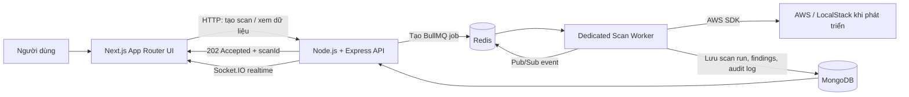

# CPSM Architecture Story

Tài liệu này là cách giải thích kiến trúc CPSM theo mạch kể chuyện, phù hợp cho demo kỹ thuật, bảo vệ đồ án hoặc phỏng vấn. Nội dung phản ánh kiến trúc hiện tại của dự án: Next.js frontend, Node.js/Express API, MongoDB, Redis/BullMQ, worker AWS, Socket.IO và AWS SDK/LocalStack.

## 1. Câu chuyện: vấn đề trước, kiến trúc sau

Một đội cloud có thể có hàng trăm tài nguyên AWS: S3 buckets, EC2 security groups, IAM users và nhiều dịch vụ khác. Câu hỏi quan trọng không chỉ là *“có lỗi không?”*, mà là:

1. Tài khoản AWS hiện có đang an toàn không?
2. Lỗi nằm ở tài nguyên nào và mức độ nghiêm trọng ra sao?
3. Ai cần xử lý và thao tác nào có thể thực hiện an toàn?

Ban đầu, nếu API gọi AWS và quét toàn bộ tài nguyên ngay trong HTTP request, người dùng phải chờ lâu. Request có thể timeout, khó hủy, khó retry và không thể mở rộng khi nhiều người cùng bấm scan.

Vì vậy CPSM được thiết kế theo mô hình **API nhận yêu cầu nhanh, worker xử lý scan bất đồng bộ**. Người dùng nhận `202 Accepted` cùng `scanId` ngay lập tức; phần quét AWS được đưa vào queue để worker xử lý đáng tin cậy. Đây là điểm xoay của toàn bộ kiến trúc.

## 2. Sơ đồ block cấp cao



Một yêu cầu tiêu biểu đi theo đường này:

```text
Start New Scan → POST /api/v1/scans/scan
→ API tạo ScanRun = queued và BullMQ job
→ trả 202 + scanId
→ worker lấy job, quét AWS, lưu findings
→ Socket.IO cập nhật queued/running/completed
→ dashboard hiển thị kết quả
```

## 3. Luồng dữ liệu: synchronous và asynchronous

### Luồng đồng bộ

Các thao tác cần phản hồi nhanh đi qua HTTP:

- UI lấy lịch sử scan: `GET /api/v1/scans/runs`.
- UI lấy findings: `GET /api/v1/scans/scans`.
- UI tạo scan: `POST /api/v1/scans/scan`.
- UI hủy scan: `POST /api/v1/scans/runs/:scanId/cancel`.

`POST /scan` không chờ AWS hoàn thành. API tạo `ScanRun`, đưa `scanId` vào BullMQ và trả `202 Accepted`.

### Luồng bất đồng bộ

Worker nhận job từ Redis/BullMQ rồi:

1. Chuyển `ScanRun` từ `queued` sang `running`.
2. Quét S3, EC2 security groups và IAM users qua AWS SDK.
3. Áp dụng rule engine để xác định finding/violation.
4. Upsert `ScanResult` vào MongoDB.
5. Lưu audit log và cập nhật progress/summary cho `ScanRun`.
6. Phát sự kiện realtime qua Redis Pub/Sub để API gửi Socket.IO cho UI.

Kết quả chính thức, lâu dài nằm ở MongoDB. Redis chỉ lưu queue, trạng thái job ngắn hạn, control message và Pub/Sub; Redis không phải nơi lưu findings lâu dài.

## 4. Các tầng component

| Tầng | Thành phần CPSM | Trách nhiệm |
|---|---|---|
| Presentation / Client | Next.js App Router, React, Tailwind, Recharts, Socket.IO client | Dashboard, scan form, findings, settings, notification, realtime state |
| API / Business logic | Express controllers, services, rule engine | Validate HTTP request, idempotency, tạo job, trả dữ liệu, API contract |
| Async processing | BullMQ queue, dedicated worker | Quét AWS, retry, timeout, cancellation, DLQ |
| Data / Repository | MongoDB models: `ScanRun`, `ScanResult`, `AuditLog` | Lưu trạng thái scan, findings và audit history |
| Integration | AWS SDK, Discord, Socket.IO, Redis Pub/Sub | AWS scan, alert, realtime communication |

Điểm quan trọng: frontend **không gọi Redis hoặc BullMQ trực tiếp**. Nó chỉ làm việc với API và Socket.IO.

## 5. Các quyết định thiết kế quan trọng

### API + worker riêng thay vì scan ngay trong controller

Chúng ta chọn worker riêng để scan không làm block HTTP request. Điều này giúp có timeout độc lập, retry, cancel, concurrency limit và scale worker mà không phải scale API theo cùng tỉ lệ.

### BullMQ + Redis cho công việc dài hạn

BullMQ cung cấp queue, delayed retry, job state và xử lý job. Redis phù hợp vì BullMQ dùng Redis làm storage queue và Pub/Sub. MongoDB vẫn là nguồn dữ liệu chính cho lịch sử và findings.

### Modular monolith thay vì microservices hoàn toàn

Hiện tại API là **modular monolith** và worker là process/container riêng, chưa phải hệ microservices đầy đủ. Đây là trade-off có chủ ý: triển khai và debug nhanh hơn, nhưng vẫn tách được workload nặng nhất là AWS scan.

### Idempotency Key

Mỗi yêu cầu tạo scan cần `Idempotency-Key`. Nếu client retry cùng request do mạng chập chờn, API trả lại scan cũ thay vì tạo thêm scan trùng.

### Next.js frontend với service layer

UI được tách `components`, `services`, `types`, `hooks`, `mocks` và validation schemas. Điều này tránh việc gọi API rải rác trong React component và cho phép thay mock bằng endpoint thật khi backend hoàn thiện.

## 6. Khả năng mở rộng và capacity

Hiện tại cấu hình mặc định có thể điều chỉnh bằng environment variables:

```env
SCAN_CONCURRENCY=2
SCAN_TIMEOUT_MS=600000
SCAN_MAX_ATTEMPTS=4
SCAN_BACKOFF_MS=5000
```

Ý nghĩa:

- Tối đa 2 scan chạy đồng thời trên queue toàn cục.
- Một scan bị giới hạn 10 phút mặc định.
- Job có tối đa 4 lần thử.
- Retry dùng exponential backoff, bắt đầu từ 5 giây.

Khi tải tăng, hướng mở rộng là:

1. Đặt API phía sau load balancer và tăng số replica API vì API chủ yếu nhận/trả request ngắn.
2. Tăng số worker container, nhưng giữ global concurrency phù hợp AWS rate limit.
3. Tách queue theo account hoặc theo loại workload nếu scan/report/remediation tăng lớn.
4. Thêm MongoDB replica set; khi dữ liệu findings lớn, cân nhắc index theo `scanId`, account, severity, thời gian và chiến lược archive/partition.
5. Thêm observability: queue depth, worker utilization, scan duration percentile, retry/DLQ rate.

Chưa có số liệu QPS hay DAU production trong dự án hiện tại, nên không nên khẳng định một capacity cố định. Capacity cần được xác định bằng load test với số AWS account, số resource và AWS API quota thực tế.

## 7. Fault tolerance: khi có lỗi thì sao?

| Rủi ro | Cơ chế hiện có |
|---|---|
| Client gửi lại request tạo scan | Idempotency Key ngăn tạo job trùng |
| AWS throttling / network error tạm thời | BullMQ exponential backoff retry |
| AWS credential/permission không hợp lệ | Phân loại non-retryable error, job fail rõ ràng |
| Scan chạy quá lâu | `SCAN_TIMEOUT_MS` abort job |
| Retry hết lần | Job đi vào dead-letter queue, `ScanRun` thành `failed` |
| Người dùng hủy | Xóa job đang chờ hoặc gửi cancel signal đến worker đang chạy |
| Socket.IO mất kết nối | UI hiển thị realtime disconnected và polling scan status |

Điểm cần bổ sung cho production lớn hơn:

- Redis high availability/sentinel hoặc managed Redis.
- MongoDB replica set và backup/restore rehearsal.
- Circuit breaker cho AWS service lỗi liên tục.
- Alert khi DLQ tăng, worker chết hoặc queue backlog cao.

## 8. Cách trình bày theo vai trò cá nhân

Trong phỏng vấn, có thể trình bày theo mẫu sau và thay đổi theo phần bạn thực sự làm:

> “Team xây dựng CPSM để phát hiện cloud misconfiguration. Phần tôi tập trung là thiết kế luồng scan bất đồng bộ: API trả `202` cùng `scanId`, job được enqueue bằng BullMQ, worker riêng quét AWS, retry theo exponential backoff, timeout, DLQ, cancellation và idempotency. Tôi cũng kết nối trạng thái này với dashboard Next.js qua Socket.IO và polling fallback.”

Nếu bạn làm phần UI, có thể thêm:

> “Tôi tổ chức frontend thành service layer, types, hooks và mock layer; xây dựng dashboard, scan progress, findings, profile, notification, light/dark/system theme và session logout. Những endpoint backend chưa có được hiển thị rõ là mock/dependency, không giả vờ xử lý thành công.”

## 9. Security và authentication

Các nguyên tắc đang áp dụng:

- Frontend không lưu AWS access key và không gọi Redis/BullMQ trực tiếp.
- AWS account UI hướng tới AssumeRole ARN, không yêu cầu nhập access key.
- API client có thể đính JWT từ local storage nếu backend auth trả token.
- Role UI (Viewer, Analyst, Approver, Admin) dùng để ẩn/disable thao tác như create scan, account management, auto-fix.
- Backend vẫn phải là nơi kiểm tra quyền cuối cùng; frontend không đủ để bảo vệ API.
- Auto-fix S3 cần permission UI và confirmation trước khi gọi API.
- Không render stack trace hoặc secret trong UI.

Các việc bắt buộc trước production:

1. Dùng HTTPS/TLS thật; không đặt `NODE_TLS_REJECT_UNAUTHORIZED=0`.
2. Chuyển local preview login sang authentication thật (JWT/OAuth/session cookie) và refresh token strategy phù hợp.
3. Mã hóa secret ở rest, dùng secret manager và IAM least privilege.
4. Thực thi RBAC tại Express middleware cho mọi endpoint nhạy cảm.
5. Audit các thao tác remediation, approval và logout/session revocation.

## 10. Kết quả và trade-offs

### Kết quả hiện tại

- Scan không block HTTP; người dùng nhận `202` và theo dõi theo `scanId`.
- Queue/worker hỗ trợ retry, timeout, cancellation, DLQ, concurrency limit và idempotency.
- UI Next.js có dashboard, scan history/detail, findings, AWS account mock, notification, profile/theme/settings/logout.
- Smoke test backend đã xác minh API → queue → worker → MongoDB → completed scan hoạt động với LocalStack.

### Trade-offs trung thực

- Modular monolith + worker nhanh để phát triển hơn microservices hoàn chỉnh, nhưng cần tách thêm services khi domain lớn.
- MongoDB linh hoạt cho scan result, nhưng cần chiến lược index/archive khi dữ liệu tăng.
- Local mock cho profile, AWS accounts và notifications giúp UI hoàn thiện sớm, nhưng phải thay bằng API thật để đồng bộ đa thiết bị/người dùng.
- LocalStack tốt cho phát triển, nhưng không thay thế hoàn toàn integration test trên AWS thật.
- UI role/session hiện là preview cục bộ; RBAC production vẫn cần backend enforcement.

### Kết luận một câu

> CPSM dùng kiến trúc API nhanh + queue/worker đáng tin cậy để biến việc quét AWS dài và dễ lỗi thành một workflow có thể theo dõi, retry, hủy và mở rộng; UI chỉ cần hiển thị trạng thái và kết quả gần realtime cho người dùng.
